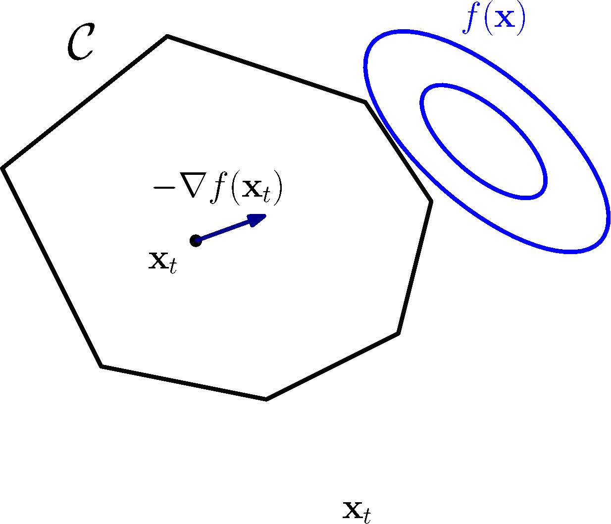

My research revolves around **computational optimization**, see a non-exhaustive list on the [homepage](/#about).
If solving hard problems, designing and implementing efficient algorithms for convex or mixed-integer optimization, or applying these techniques to concrete applications hypes you, reach out!



# Current Topics

## Ph.D.

Doctoral projects are open-ended by nature, the precise topic has to be discussed and adapted to the candidate, so I won' t have a precise list of current subjects (for now).
If you are interested in starting a Ph.D. in **Autumn 2024**, reach out soon enough (Spring 2024 at the latest) so that we can exchange on your interests and formalize and prepare a topic.

## Master's internships and Master's theses

The following topics would be suitable for Master's students, some would be good 1-2 month projects, some could constitute a Master's thesis / graduation project (6 months).

### First-Order Methods for Constrained Optimization

<!--  -->



I am working on the [FrankWolfe.jl](https://github.com/ZIB-IOL/FrankWolfe.jl) solver. I have a lot of open threads that can become cool internships or projects:

- designing and implementing new Frank-Wolfe variants within the package like the [Nearest Extreme Point](https://proceedings.mlr.press/v134/garber21a.html) oracle or a stabilized version of the [Blended Conditional Gradients](https://arxiv.org/abs/1805.07311)
- implementing specialized methods based on Frank-Wolfe for some problems in data science and machine learning (such as tensor completion, sparse regression), and in operations research (such as traffic equilibrium).

### Mixed-Integer Convex Optimization



I am working on several methods for optimization methods for mixed-integer problems with a convex relaxation: how to combine techniques from the continuous (convex) and discrete world?
You can read about some examples in our [preprint](https://arxiv.org/abs/2208.11010) describing the methods implemented in the [Boscia.jl](https://github.com/ZIB-IOL/Boscia.jl) solver.

Topics for projects will include:
- Applications in [sparse statistics](https://optimization-online.org/wp-content/uploads/2022/10/manuscript-1.pdf), [optimal control](https://arxiv.org/abs/2005.14346)
- Development of specialized [primal heuristics](https://link.springer.com/article/10.1007/s10898-017-0600-3) within the Boscia.jl solver.

### Mixed-Integer (Nonlinear) Optimization



I am working on [SCIP](https://scipopt.org), the largest open-source solver for mixed-integer (non)linear optimization.
Projects within SCIP will include cutting planes, heuristics, performance evaluation and presolving.
Depending on the type of project, we will probably team up with other people working on the solver.

**NB**: working on SCIP will mean being relatively confident programming in C and using the surrounding tooling (CMake, gcc).

# Profiles

I love working with curious and eager learners. Saying that you don't know XYZ is okay, as long as you are willing to learn.
Majors that naturally work well for me are people who studied **Applied Mathematics**, **Operations Research**, **Computer Science** and are already familiar with optimization.
Most projects I have will require good programming skills, some will require familiarity with optimization concepts (duality, polyhedral theory, mixed-integer sets, ...).

There is an unfortunate [bias](https://www.theatlantic.com/magazine/archive/2014/05/the-confidence-gap/359815/) in the gender of applicants feeling "qualified" for the role.
If you feel you belong to an underrepresented group in applied mathematics and computing sciences, I especially encourage you to apply (here and in general), even if when you are unsure about your qualifications.

In general, if you have doubts, reach out and let's discuss, there might be a project that fits you well and that you hadn't seen.

# Location(s)

I am working in the [LIG](https://www.liglab.fr/en) laboratory in Grenoble and will look for students here.  

If you are in Berlin, I *can* take students in co-supervision with someone else in the [IOL](https://iol.zib.de) lab.
See the [instructions](https://iol.zib.de/openings/) to apply.  
**I will be able to supervise a project only if there is a suitable co-supervisor available in Berlin.**
A project in Berlin can in particular be suitable if you want to work on [SCIP](https://scipopt.org).
